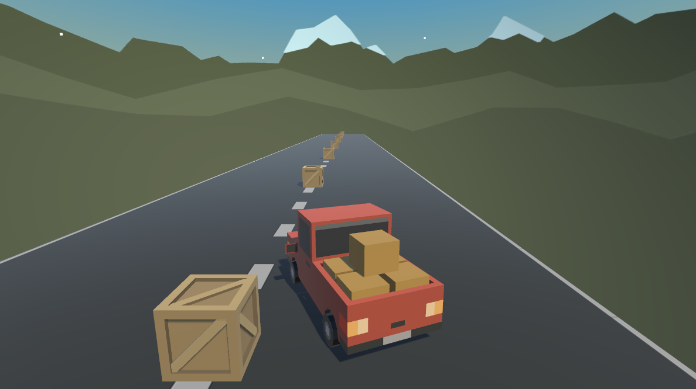

# Vehicle Control Learning Project

I created this project to learn and implement vehicle/player control in Unity. The project features a drivable vehicle navigating a straight road with obstacles, showcasing responsive controls and realistic collision detection with game objects. 

